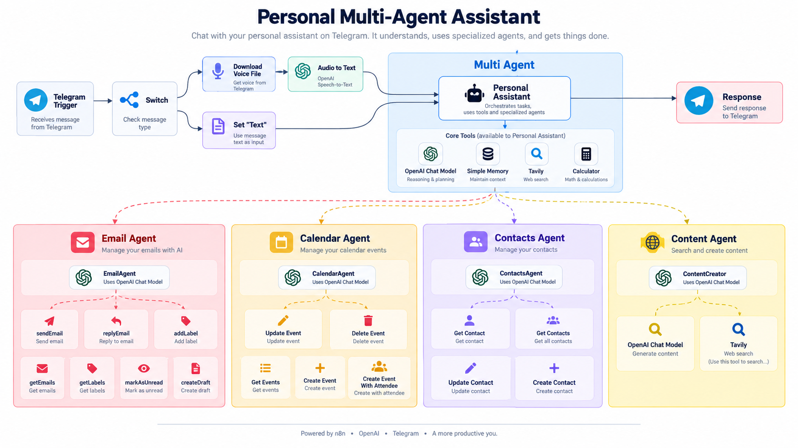

## 🧠 Arquitetura do Sistema

O projeto utiliza uma arquitetura **multiagente**, organizada em torno de um agente orquestrador central.

O **Assistente Pessoal** interpreta a solicitação recebida pelo Telegram e identifica qual agente ou ferramenta deve ser acionado para executar a tarefa.

Cada agente possui uma responsabilidade específica, permitindo separar as funcionalidades e facilitar a manutenção e expansão do workflow.

### 🔄 Fluxo dos Agentes

<p align="center">
  
</p>

### Como funciona

1. O usuário envia uma mensagem de **texto ou áudio pelo Telegram**.
2. Mensagens de áudio são convertidas em texto utilizando **OpenAI Speech-to-Text**.
3. O **Agente Orquestrador** interpreta a intenção do usuário.
4. A solicitação é encaminhada para o agente ou ferramenta correspondente.
5. O agente executa a ação utilizando o serviço integrado.
6. O resultado retorna ao usuário pelo **Telegram**.

### Agentes e integrações

- 📧 **Agente de E-mail** → Gmail
- 📅 **Agente de Calendário** → Google Calendar
- 👥 **Agente de Contatos** → Google Contacts
- ✍️ **Criador de Conteúdo** → OpenAI + Tavily
- 🌐 **Pesquisa Web** → Tavily
- 🧮 **Cálculos** → Calculator
- 🧠 **Memória** → Simple Memory

## ⚙️ Funcionamento do Workflow

### 1. Entrada pelo Telegram

O **Telegram Trigger** funciona como ponto de entrada do sistema.

O usuário pode enviar:

* mensagens de texto;
* mensagens de voz.

Um nó **Switch** identifica automaticamente o tipo da entrada.

#### Mensagem de texto

O conteúdo segue diretamente para processamento pelo agente.

#### Mensagem de voz

O workflow:

1. baixa o arquivo de áudio;
2. envia o áudio para transcrição;
3. utiliza a **OpenAI** para converter voz em texto;
4. encaminha o texto resultante ao agente orquestrador.

---

## 🧠 Agente Orquestrador

O **Assistente Pessoal Completo** funciona como o núcleo do sistema.

Sua principal função é identificar a intenção do usuário e selecionar o agente especializado adequado para executar a tarefa.

O agente utiliza **Simple Memory**, permitindo manter contexto entre as interações.

### Ferramentas disponíveis

* 📧 `AgenteDeEmail`
* 📅 `AgenteDeCalendario`
* 👥 `AgenteDeContatos`
* ✍️ `CriadorDeConteudo`
* 🌐 `Tavily`
* 🧮 `Calculadora`
* 🧠 `Think`

---

## 📧 Agente de E-mail

Integração com **Gmail** para gerenciamento de mensagens.

### Operações disponíveis

* Enviar e-mail
* Responder e-mail
* Criar rascunho
* Buscar e-mails
* Buscar etiquetas
* Marcar mensagens como não lidas
* Adicionar etiquetas

### Ferramentas do workflow

```text
enviarEmail
responderEmail
criarEsboco
buscarEmails
buscarEtiquetas
marcarComoNaoVisualizado
adicionarEtiqueta
```

Os e-mails podem ser gerados em **HTML**, permitindo mensagens com formatação estruturada e profissional.

---

## 📅 Agente de Calendário

Integração com **Google Calendar** para gerenciamento de agenda.

### Operações disponíveis

* Criar eventos
* Criar eventos com participantes
* Buscar eventos
* Atualizar eventos
* Excluir eventos

### Ferramentas utilizadas

```text
Criar Evento
Criar Evento Com Participante
Buscar Eventos
Atualizar Evento
Apagar Evento
```

Sempre que possível, o sistema retorna o **link do evento criado ou atualizado**.

---

## 👥 Agente de Contatos

Responsável pela integração com **Google Contacts**.

### Operações disponíveis

* Buscar contatos
* Listar contatos
* Criar contatos
* Atualizar contatos

### Ferramentas utilizadas

```text
Buscar Contatos
Buscar Todos os Contatos do Google
Criar Contato
Atualizar Contato
```

Para atualizações, o workflow utiliza o **Contact ID** como identificador do registro.

---

## ✍️ Criador de Conteúdo

Agente especializado em geração de conteúdo utilizando:

* **OpenAI**
* **Tavily**

O Tavily é utilizado para obter informações externas, enquanto a OpenAI é responsável pela geração e estruturação do conteúdo.

### O agente pode gerar

* Posts para blog
* Conteúdo estruturado
* Textos baseados em pesquisas
* Conteúdo otimizado para leitura
* Conteúdo com foco em SEO

A saída pode ser formatada em HTML utilizando elementos como:

```html
<h1></h1>
<h2></h2>
<p></p>
<ul></ul>
<li></li>
<a></a>
```

Links encontrados durante as pesquisas podem ser transformados automaticamente em **hiperlinks clicáveis**.

---

## 🌐 Pesquisa na Web

O workflow utiliza **Tavily** para realizar pesquisas externas quando uma solicitação depende de informações disponíveis na internet.

Os resultados podem ser utilizados como contexto para geração de respostas ou criação de conteúdo.

---

## 🧮 Calculadora

O agente orquestrador possui acesso a uma ferramenta de cálculo para realizar operações matemáticas sem depender exclusivamente do modelo de linguagem.

---

## 💾 Memória Contextual

O sistema utiliza **Simple Memory** para manter informações relevantes ao longo da conversa.

Isso permite que solicitações posteriores utilizem o contexto de mensagens anteriores.

### Exemplo

```text
Usuário:
Agende uma reunião amanhã às 14h com João.

Usuário:
E envie um e-mail avisando sobre a reunião.
```

O agente pode utilizar o contexto anterior para interpretar corretamente a segunda solicitação.

---

## 🔄 Regras de Orquestração

O sistema possui regras para direcionar corretamente cada solicitação.

### Delegação de tarefas

O agente orquestrador identifica a intenção do usuário e encaminha a solicitação para o agente especializado correspondente.

### Busca de contatos

Antes de operações que dependam de uma pessoa específica, o sistema pode consultar o **Google Contacts** para localizar as informações necessárias.

### Exemplo

```text
"Envie um e-mail para João."
```

Fluxo:

```text
Buscar contato
      ↓
Obter e-mail
      ↓
Agente de E-mail
      ↓
Enviar mensagem
```

O mesmo princípio é utilizado para criação de eventos com participantes.

---

## 🧠 Validação com Think

O workflow inclui um nó de **Think**, utilizado pelo agente para analisar determinadas solicitações antes da execução.

Esse mecanismo auxilia na:

* escolha da ferramenta correta;
* validação da ação;
* organização de tarefas complexas;
* redução de chamadas incorretas entre agentes.

---

## 🛠️ Tecnologias Utilizadas

### Automação

`n8n`

### Inteligência Artificial

`OpenAI`
`LLMs`
`AI Agents`
`Speech-to-Text`
`Prompt Engineering`

### Integrações

`Telegram API`
`Gmail`
`Google Calendar`
`Google Contacts`
`Tavily`

### Conceitos

`Multi-Agent Systems`
`Workflow Automation`
`API Integration`
`Tool Calling`
`Context Memory`
`Webhooks`

---

## 💡 Arquitetura Multiagente

O projeto divide as responsabilidades entre diferentes agentes especializados, em vez de concentrar todas as funções em um único agente.

```text
                  ┌─────────────────────────┐
                  │   Agente Orquestrador  │
                  └────────────┬────────────┘
                               │
          ┌────────────────────┼────────────────────┐
          │                    │                    │
          ▼                    ▼                    ▼
     Agente Email        Agente Calendário    Agente Contatos
          │                    │                    │
          ▼                    ▼                    ▼
        Gmail          Google Calendar      Google Contacts

                               │
                     ┌─────────┴─────────┐
                     │                   │
                     ▼                   ▼
             Criador Conteúdo        Tavily
                     │
                     ▼
                   OpenAI
```

Essa abordagem facilita:

* separação de responsabilidades;
* manutenção do workflow;
* expansão futura do sistema;
* integração de novos agentes e ferramentas.

---

## 📌 Possíveis Evoluções

Algumas funcionalidades que podem ser adicionadas futuramente:

* Integração com WhatsApp
* Integração com Notion
* Integração com bancos de dados
* Gerenciamento de tarefas
* Persistência de memória de longo prazo
* RAG com documentos pessoais
* Dashboard de monitoramento
* Logs de execução
* Controle de permissões para ações críticas
* Novos agentes especializados

---

## ✅ Resumo

Este projeto demonstra a implementação de um **assistente pessoal multiagente utilizando n8n e Inteligência Artificial**.

O sistema combina:

**Automação + IA + APIs + Agentes + Integração entre Serviços**

O projeto explora conceitos como:

* arquitetura multiagente;
* agentes especializados;
* orquestração de ferramentas;
* integração de APIs;
* processamento de linguagem natural;
* automação de workflows;
* memória contextual;
* tool calling.

---

## 👩‍💻 Autora

**Lara Santos Pereira Soares**

💼 [LinkedIn](https://linkedin.com/in/lara-soares-668a97326)
🐙 [GitHub](https://github.com/lara-softdeveloper)

---

⭐ Se este projeto foi útil ou interessante, considere deixar uma **Star** no repositório.


